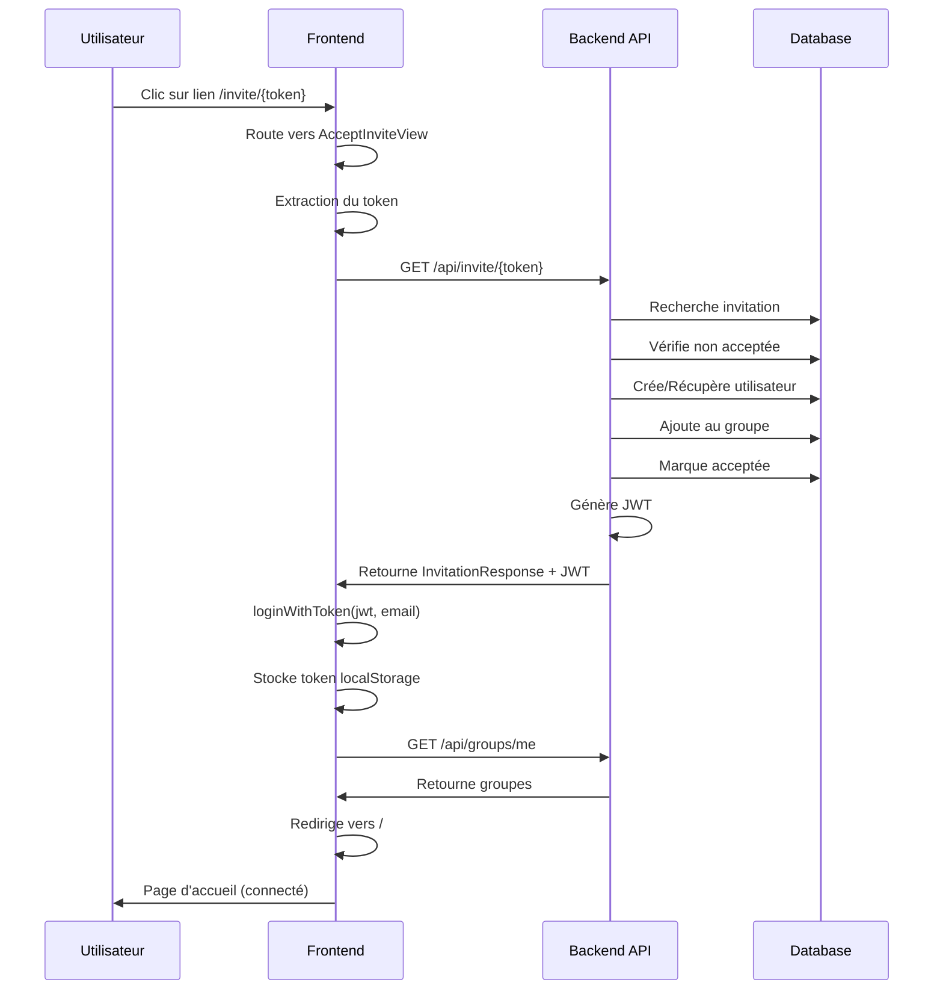

# Fonctionnalité : Acceptation automatique d'invitation

## ✅ Implémentation terminée

L'utilisateur peut maintenant accepter une invitation simplement en cliquant sur le lien d'invitation. Il est automatiquement connecté sans passer par la mire de connexion.

---

## 🔄 Flux d'acceptation d'invitation

### 1. L'admin envoie une invitation

1. L'admin ouvre le dialog des membres d'un groupe
2. Saisit un email et envoie l'invitation
3. Un lien d'invitation est généré : `http://localhost:3000/invite/{token}`
4. L'admin copie le lien et l'envoie par email (ou autre moyen)

### 2. L'utilisateur invité clique sur le lien

**URL format** : `http://localhost:3000/invite/abc12345-def6-7890-ghij-klmnopqrstuv`

**Actions automatiques :**
1. L'utilisateur accède à `/invite/:token`
2. La page `AcceptInviteView` se charge
3. Le token est extrait de l'URL
4. L'API `GET /api/invite/:token` est appelée automatiquement
5. Le backend :
   - Vérifie que le token est valide
   - Crée un utilisateur avec l'email (si inexistant)
   - Ajoute l'utilisateur au groupe
   - Marque l'invitation comme acceptée
   - Retourne un JWT pour l'utilisateur
6. Le frontend :
   - Reçoit le JWT
   - Connecte automatiquement l'utilisateur via `loginWithToken()`
   - Stocke le token dans localStorage
   - Charge les groupes de l'utilisateur
   - Redirige vers la page d'accueil après 2 secondes

### 3. L'utilisateur est connecté

- **Pas de mire de connexion** : l'utilisateur est directement connecté
- **Affichage classique utilisateur non-admin** :
  - Pas de bouton "Créer un groupe"
  - Liste des groupes auxquels il appartient
  - Pas d'icône "œil" pour voir les invitations
  - Pas d'accès aux statuts des invitations

---

## 📁 Fichiers créés/modifiés

### Nouveaux fichiers

1. **`src/views/AcceptInviteView.vue`** - Page d'acceptation d'invitation
   - Affiche un loader pendant l'acceptation
   - Affiche un message de succès
   - Gère les erreurs (token invalide, déjà accepté, etc.)
   - Redirige automatiquement vers l'accueil

### Fichiers modifiés

2. **`src/router/index.ts`** - Route ajoutée
   ```typescript
   {
     path: '/invite/:token',
     name: 'accept-invite',
     component: () => import('../views/AcceptInviteView.vue'),
   }
   ```

3. **`src/stores/auth.ts`** - Méthode ajoutée
   - `loginWithToken(jwtToken, email)` : Connexion automatique sans mot de passe
   - Décode le JWT
   - Crée l'objet User
   - Met à jour le localStorage
   - Charge les groupes

---

## 🎨 Interface utilisateur

### Page d'acceptation

```
┌──────────────────────────────────────────┐
│  ✉️ Acceptation de l'invitation          │
├──────────────────────────────────────────┤
│                                           │
│         [Spinner animé]                   │
│   Acceptation de votre invitation...      │
│  Veuillez patienter pendant que nous     │
│         créons votre compte               │
│                                           │
└──────────────────────────────────────────┘
```

**Après succès :**

```
┌──────────────────────────────────────────┐
│  ✉️ Acceptation de l'invitation          │
├──────────────────────────────────────────┤
│                                           │
│         ✅ [Icône check vert]            │
│       Invitation acceptée !               │
│                                           │
│   Bienvenue user@example.com             │
│  Vous allez être redirigé vers votre     │
│         tableau de bord...                │
│                                           │
│   [Barre de progression]                  │
│                                           │
└──────────────────────────────────────────┘
```

**En cas d'erreur :**

```
┌──────────────────────────────────────────┐
│  ✉️ Acceptation de l'invitation          │
├──────────────────────────────────────────┤
│                                           │
│         ❌ [Icône erreur rouge]          │
│              Erreur                       │
│                                           │
│  ┌────────────────────────────────────┐  │
│  │ ⚠️ Invitation non trouvée          │  │
│  │    ou expirée                       │  │
│  └────────────────────────────────────┘  │
│                                           │
│         [Retour à l'accueil]             │
│                                           │
└──────────────────────────────────────────┘
```

---

## 🔒 Sécurité

### Vérifications backend

- ✅ Token UUID unique et non devinable
- ✅ Vérification que le token existe
- ✅ Vérification que l'invitation n'est pas déjà acceptée
- ✅ Création sécurisée de l'utilisateur
- ✅ Génération d'un JWT valide

### Gestion des erreurs

| Erreur | Code HTTP | Message |
|--------|-----------|---------|
| Token manquant | - | "Token d'invitation manquant" |
| Token invalide | 404 | "Invitation non trouvée ou expirée" |
| Déjà acceptée | 400 | "Cette invitation a déjà été acceptée" |
| Erreur serveur | 500 | "Erreur lors de l'acceptation de l'invitation" |

---

## 🧪 Tests à effectuer

### Test 1 : Acceptation normale
1. Admin envoie une invitation
2. Copier le lien d'invitation
3. Ouvrir le lien dans un navigateur
4. ✅ Page de chargement s'affiche
5. ✅ Message de succès après quelques secondes
6. ✅ Redirection automatique vers l'accueil
7. ✅ Utilisateur connecté (pas d'admin)
8. ✅ Groupes affichés

### Test 2 : Token invalide
1. Accéder à `/invite/token-inexistant`
2. ✅ Message d'erreur "Invitation non trouvée ou expirée"
3. ✅ Bouton "Retour à l'accueil" visible

### Test 3 : Invitation déjà acceptée
1. Accepter une invitation (Test 1)
2. Cliquer à nouveau sur le même lien
3. ✅ Message "Cette invitation a déjà été acceptée"

### Test 4 : Token manquant
1. Accéder à `/invite/` (sans token)
2. ✅ Message d'erreur "Token d'invitation manquant"

### Test 5 : Persistance de session
1. Accepter une invitation
2. Rafraîchir la page (F5)
3. ✅ Utilisateur toujours connecté
4. ✅ Groupes affichés

---

## 📊 Comparaison Admin vs Utilisateur

| Fonctionnalité | Admin | Utilisateur invité |
|----------------|-------|-------------------|
| **Connexion** | Email + mot de passe | Lien d'invitation (auto) |
| **Bouton "Créer un groupe"** | ✅ Visible | ❌ Masqué |
| **Liste des groupes** | ✅ Tous ses groupes | ✅ Ses groupes |
| **Icône "œil" sur groupe** | ✅ Voir invitations | ❌ Masqué |
| **Envoyer des invitations** | ✅ Oui | ❌ Non |
| **Voir statuts invitations** | ✅ Accepté/En attente | ❌ Non |

---

## 🔄 Flux complet



---

## ✅ Conforme aux spécifications

| Spécification | Status |
|---------------|--------|
| URL avec token → API appelée automatiquement | ✅ |
| Pas de mire de connexion | ✅ |
| Affichage classique user non-admin | ✅ |
| Pas de bouton "Créer un groupe" | ✅ |
| Liste des groupes uniquement | ✅ |
| Pas d'accès aux invitations | ✅ |

---

## 🎉 Fonctionnalité complète

L'acceptation d'invitation est maintenant **entièrement automatique** :
- ✅ Un clic sur le lien suffit
- ✅ Pas besoin de se connecter
- ✅ L'utilisateur est créé automatiquement
- ✅ Ajouté au groupe automatiquement
- ✅ Connecté automatiquement
- ✅ Redirigé automatiquement

**L'expérience utilisateur est fluide et transparente !** 🚀

